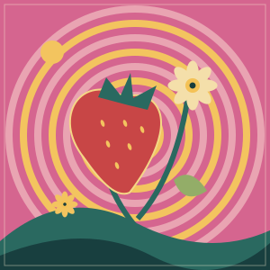
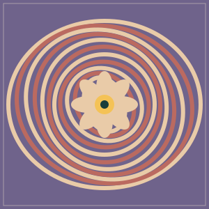

<p align="center">
  
</p>

<h1 align="center">Today, Oh Boy!</h1>

<p align="center"><strong>Your Beatles ranking, one comparison at a time.</strong></p>
<p align="center">213 songs · 35 releases · Progress saved on your device</p>

<p align="center">
  <a href="#quick-start">Quick start</a> ·
  <a href="#how-to-use-it">How to use it</a> ·
  <a href="#artwork">Artwork</a> ·
  <a href="#development">Development</a>
</p>

Choose between two songs, say how much you prefer your favourite, and watch your personal chart take shape. Today, Oh Boy! pairs original album covers with a warm, illustrated record-shop feel inspired by 1960s British pop.

Built with **React, TypeScript, Vite, and plain CSS**. Runs entirely in the browser, with no account or backend setup.

## What you can do

- **Build your chart.** Choose “Slightly better,” “Better,” or “Much better” beneath either song. Adaptive comparisons introduce new songs and help refine close calls.
- **Listen before choosing.** Open either song in the shared YouTube player. Listening never casts a vote.
- **Explore your ranking.** See your top five, or search the full list by song or album. Songs you haven’t compared stay visibly unranked.
- **Browse the records.** Explore original album covers, ordered track lists, release details, credits, and links to Beatles Bible. Include compilations and live releases to browse the wider archive.
- **Pick up where you left off.** Votes and the current pair survive a refresh. Undo a vote, skip a pair, or start again with a confirmed reset.

## Quick start

Requires **Node.js 22.12 or later** and **npm**. From the project directory:

```sh
npm ci
npm run dev
```

Open the URL printed by Vite, usually **http://localhost:5173**. No API keys or environment variables are required.

Use `localhost` for local playback: YouTube embeds were verified there, while the numeric `127.0.0.1` address failed in the test browser. Progress is stored separately for each origin, so changing the hostname or port gives you a different save.

To check the production build locally:

```sh
npm run build
npm run preview
```

The static production files are written to `dist/`. Serve them over HTTP or HTTPS rather than opening `index.html` directly.

## How to use it

1. **Start your own chart.** A fresh browser opens with 12 sample votes. Choose **Start my ranking** to clear the sample and begin.
2. **Compare the pair.** Pick a preference button beneath your favourite. Use **Listen**, then press play in the YouTube player if you need a reminder.
3. **Keep going at your own pace.** Each vote updates the chart immediately. **Skip** leaves your ranking unchanged; **Undo** removes your latest vote.
4. **Explore.** Choose **View full ranking** to search songs and inspect scores, or switch to **Record collection** to browse albums.

The progress bar counts songs involved in completed comparisons. It measures coverage, rather than confidence in your ranking. You can stop whenever the chart feels useful.

### Your progress

Comparison history is saved in this browser’s `localStorage`. There are no accounts or cross-device sync. Clearing site data removes your save; **Reset progress** also clears it after confirmation. If storage cannot be read or written, the app displays a notice.

## How ranking works

The ranking uses a **Bradley–Terry-style logistic model**. Preference strength sets the model’s target probability for the chosen song:

| Your choice | Target probability |
| --- | --- |
| Slightly better | 0.65 |
| Better | 0.80 |
| Much better | 0.95 |

Ratings are fitted again from the complete comparison history after each vote or undo. History is the source of truth; scores are derived, relative values rather than points awarded for a win.

The pair selector excludes answered pairs, prioritises introducing unseen songs, then favours nearby ratings and songs with fewer comparisons. Skipped pairs are set aside for the session and can be revisited. Early rankings are provisional, especially while much of the catalog is still unseen.

Implementation: [ranking model and pair selector](src/ranking/model.ts) · [progress validation and persistence](src/storage/progress.ts).

## Catalog and playback

The checked-in [catalog](src/data/catalog.json) is a snapshot researched on **6 October 2026**, with source links to [The Beatles Bible](https://www.beatlesbible.com/albums/).

| Collection | Contents |
| --- | --- |
| Ranked songs | 213 distinct song titles; repeated album appearances share one entry |
| Core records | 12 original UK albums, the *Magical Mystery Tour* LP, and *Past Masters* |
| Wider archive | 21 additional releases, for 35 releases and 870 track appearances overall |
| Film score | Seven George Martin pieces available in the collection, outside the song ranking |

Archive listings preserve alternate takes, mixes, live performances, and speech. These appearances do not become separate ranked songs. Red/Blue track lists use the expanded 2023 editions; *Love* groups transitions with preceding tracks and includes the listed iTunes bonuses.

YouTube video IDs come from embeds on Beatles Bible’s song pages. The player keeps native controls, starts only when you press play, and stops when you switch songs, close it, or change the comparison. **Open on YouTube** provides a fallback when an embed cannot play. Videos may differ from a particular album mix, and availability depends on YouTube and your region.

Album covers, Google Fonts, and YouTube media load from external services. Catalog facts and your ranking work from the local snapshot; this is not a fully offline app or a live catalog service.

## Artwork

The record-shop banner above is original AI-generated artwork used in the app’s masthead. The six decorative sleeve illustrations are also preserved as standalone SVGs:

<p align="center">
  <a href="public/art/illustrated-sleeves/pepper.svg"></a>
  <a href="public/art/illustrated-sleeves/strawberry.svg"></a>
  <a href="public/art/illustrated-sleeves/sun.svg"></a>
  <a href="public/art/illustrated-sleeves/road.svg"></a>
  <a href="public/art/illustrated-sleeves/rubber.svg"></a>
  <a href="public/art/illustrated-sleeves/revolver.svg"></a>
</p>

**Original album covers remain on the song cards, ranking, and record collection.** The decorative illustrations provide a fallback when a cover fails to load. Generation prompts, asset details, and provenance are documented in [docs/artwork.md](docs/artwork.md).

<details>
<summary>Earlier masthead artwork, preserved in the project</summary>

<p></p>

This earlier generated illustration is retained at <a href="public/art/pepper-parade.webp">public/art/pepper-parade.webp</a> and is not used by the current interface.

</details>

## Development

| Command | Purpose |
| --- | --- |
| `npm run dev` | Start the Vite development server on `localhost` |
| `npm test` | Compile test modules and run the Node test suites |
| `npm run typecheck` | Check TypeScript without emitting files |
| `npm run build` | Check types and produce `dist/` |
| `npm run preview` | Serve the production build on `localhost` |

```text
src/
  components/       Comparison, ranking, collection, artwork, and player
  data/             Catalog snapshot, typed adapters, and demo votes
  media/            YouTube URL validation and construction
  ranking/          Pure rating calculations and pair selection
  storage/          Versioned persistence and saved-data validation
  App.tsx           App flow, views, and session controls
  styles.css        Responsive layout and styling
public/art/         Generated mastheads and saved sleeve illustrations
docs/artwork.md     Artwork prompts and provenance
tests/              Catalog, media, ranking, and persistence suites
scripts/test.cjs    Node test-runner entry point
```

Keep song IDs stable so existing saves remain compatible. Preserve track order, edition labels, and source references when changing the catalog. Keep ranking logic independent of React and browser storage access inside the storage adapter.

Before submitting a change, run:

```sh
npm test
npm run typecheck
npm run build
```

The tests cover preference direction and strength, transitivity, deterministic fitting, pair selection and exhaustion, persistence replay, undo, invalid saves, catalog integrity, and media URLs. For interaction changes, also check all six preference buttons, listening, refresh, undo, skip, and reset in a browser, including a narrow viewport.

## Credits and notice

Catalog facts, cover references, and video references come from [The Beatles Bible](https://www.beatlesbible.com/albums/). Album artwork belongs to its respective owners. The snapshot contains factual metadata, not lyrics or article text. Interface icons use Lucide; typography uses DM Sans and Fraunces with system fallbacks.

**Fan project · Not affiliated with or endorsed by The Beatles, Apple Corps Ltd., or YouTube.**
